# IELTS Study

A personal IELTS preparation desktop app. Practice Listening, Reading, and Writing; run full exam simulations with timed sections; build vocabulary with AI-powered flashcards; and track every session through an analytics dashboard.

Progress, settings, answers, essays, flashcards, and chat history are persisted locally in SQLite. Features that require AI send the relevant input to the configured provider, and some exercise media is loaded from `ieltsliz.com`; see [AI, Privacy, and Network Use](docs/AI_AND_PRIVACY.md) for the exact data flow.

The interface is fully multilingual: **English, Italian, French, and Spanish** are all built in. Switch language at any time from the sidebar — the choice is remembered across app restarts.

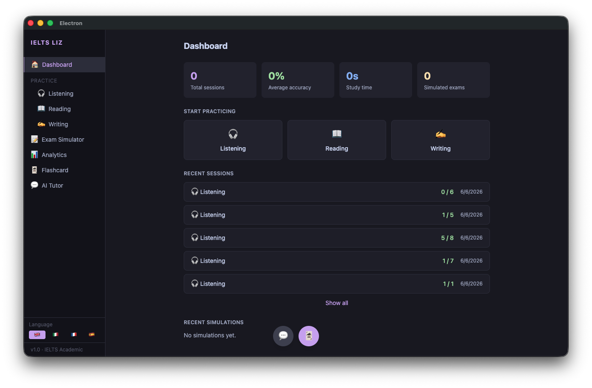

---

## Content Attribution

All exercise content in this project — including prompts, reading passages, questions, answer keys, audio, and supporting images — is sourced from [IELTS Liz](https://ieltsliz.com/). All rights to this material belong to IELTS Liz and its author; it is included here solely for personal study.

This project is independent and is not affiliated with, approved by, or endorsed by IELTS Liz or the official IELTS partners. Attribution does not grant redistribution rights; see [Third-Party Content](THIRD_PARTY_CONTENT.md) and [License](LICENSE).

---

## Contents

- [What's inside](#whats-inside)
- [Getting started](#getting-started)
- [Features in depth](#features-in-depth)
  - [Listening](#listening-practice)
  - [Reading](#reading-practice)
  - [Writing](#writing-practice)
  - [Exam Simulator](#exam-simulator)
  - [Flashcards](#flashcards)
  - [AI Tutor Chat](#ai-tutor-chat)
  - [Analytics](#analytics)
- [Application structure](#application-structure)
- [Local database](#local-database)
- [Internationalisation](#internationalisation)
- [AI integration, privacy, and security](#ai-integration-privacy-and-security)
- [Content pipeline](#content-pipeline)
- [Testing and quality](#testing-and-quality)
- [Building and releasing](#building-and-releasing)
- [Tech stack](#tech-stack)

---

## What's inside

| Section | What you can do |
|---------|----------------|
| 🏠 Dashboard | Overview of recent sessions, exam results, and key stats |
| 🎧 Listening | 41 exercises across 5 question types, with audio player |
| 📖 Reading | 32 exercises across 8 question types, with split-pane layout |
| ✍️ Writing | 20 tasks (Task 1 + Task 2) with AI band scoring and model answers |
| 📝 Exam Simulator | Full timed simulation across all three sections |
| 🃏 Flashcard | Spaced-repetition vocabulary trainer with AI card generation |
| 📊 Analytics | Deep progress dashboard with band estimates, trends, and coverage |
| 💬 Chat | Persistent AI tutor chat with conversation history |

---

## Getting Started

**Prerequisites:** Node.js 22 LTS is recommended, together with npm and an API key for one supported AI provider. Copy `.env.example` to `.env` and fill in your own values:

```bash
AI_PROVIDER=anthropic          # anthropic | google | openai
AI_MODEL=claude-haiku-4-5-20251001
AI_API_KEY=your_key_here
```

```bash
npm install
npm run dev        # launches the Electron app in development mode
```

The application can open and use its local exercise library without an AI key, but writing evaluation, flashcard generation/evaluation, and AI chat will fail gracefully until a valid provider configuration is supplied.

The app opens with the **Dashboard**. From there:

1. Head to **Listening** or **Reading** for your first practice session
2. Add a word to **Flashcard** using the floating 🃏 button — it's available on every screen
3. After a few sessions, check **Analytics** to see where your accuracy drops
4. When you feel ready, run a full **Exam Simulation**

### Engineering documentation

| Document | Scope |
|---|---|
| [Architecture](docs/ARCHITECTURE.md) | Electron processes, IPC, runtime flows, trust boundaries, and extension points |
| [Data Model](docs/DATA_MODEL.md) | SQLite schema, relationships, migrations, backup, reset, and retention |
| [AI and Privacy](docs/AI_AND_PRIVACY.md) | Provider configuration, data sent off-device, response contracts, and failure modes |
| [Content Pipeline](docs/CONTENT_PIPELINE.md) | IELTS Liz attribution, scraper workflow, validation, and dataset maintenance |
| [Testing and Releases](docs/TESTING_AND_RELEASES.md) | Quality commands, current baseline, packaging, signing, and release checklist |
| [Troubleshooting](docs/TROUBLESHOOTING.md) | Startup, native module, database, media, AI, and packaging diagnostics |
| [Security Policy](SECURITY.md) | Current controls, known limitations, credential handling, and reporting |
| [Contributing](CONTRIBUTING.md) | Change workflow and engineering conventions |

---

## Features in Depth

### Dashboard

The opening screen. It loads three things in parallel:

- **Four stat cards** — total sessions completed, average accuracy across all answers, total time studied, and number of full exam simulations run. These cover the last 30 days.
- **Recent sessions** — the five most recent completed exercises, with section, score, and date.
- **Recent exam runs** — the last three simulations with per-section scores (Listening %, Reading %, Writing band). Clicking any exam run navigates to the Exam Simulator.

The dashboard is a snapshot, not a deep report — go to Analytics for charts and trends.

---

### Listening Practice

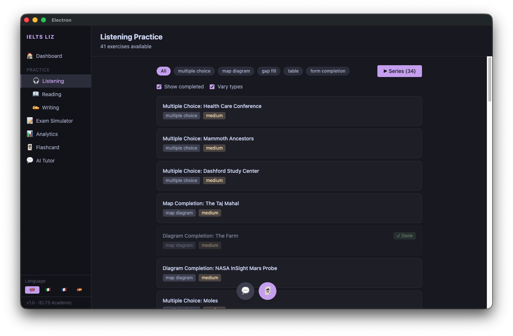

**Content:** 41 exercises. Each has an audio recording, a set of questions, and a question type label — gap fill, form completion, multiple choice, map/diagram, or table. All exercises are rated medium difficulty.

**How a session works:**

1. Browse the exercise list, optionally filtering by question type. Completed exercises are marked with a green "done" badge; you can toggle whether they appear in the list.
2. Choose a practice mode:
   - **Single** — pick one exercise and do it alone.
   - **Series by type** — queue every incomplete exercise of the selected type.
   - **Random** — a shuffled queue of up to 10 incomplete exercises.
3. The exercise opens with a **sticky audio player** at the top. Play/pause and seek freely — there's no enforced single-play rule in practice mode.
4. Answer each question in the appropriate input. Gap-fill and form-completion questions use a text field; multiple-choice questions show radio buttons; "Choose THREE" questions (options embedded in the question text) render as checkboxes parsed automatically from the `A=Label` inline format.
5. Submit with "Controlla". Results appear immediately: each question shows correct/incorrect, your answer, and the correct answer. A **band estimate** is calculated by scaling the exercise result to 40 questions and applying separate Listening or Academic Reading conversion tables, including half bands from 2.0 to 9.0. The results panel includes the **audio player** so you can replay the recording while reviewing.

**Answer matching** is flexible: a multiple-choice answer stored as "B – Columbian mammoth" matches the answer key "B"; True/False/Not Given and Yes/No/Not Given answers match regardless of spacing or casing; multi-select answers ("A, C, E") match any ordering of the same set.

Each completed session — score, time spent, question type, and per-question answers — is saved to the local database.

---

### Reading Practice

| Exercise browser | Practice session |
|---|---|
| 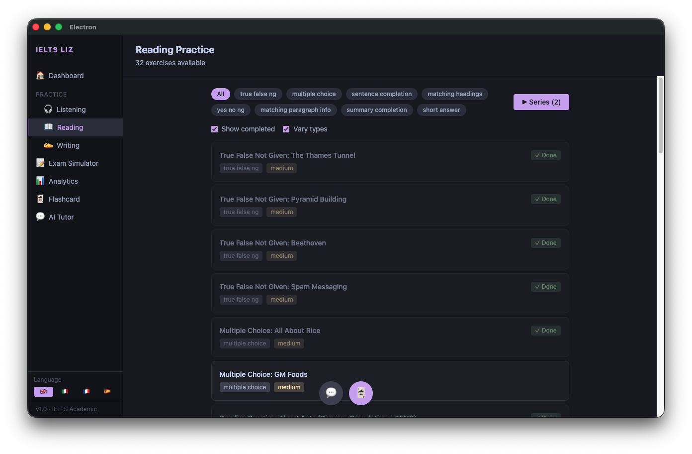 | 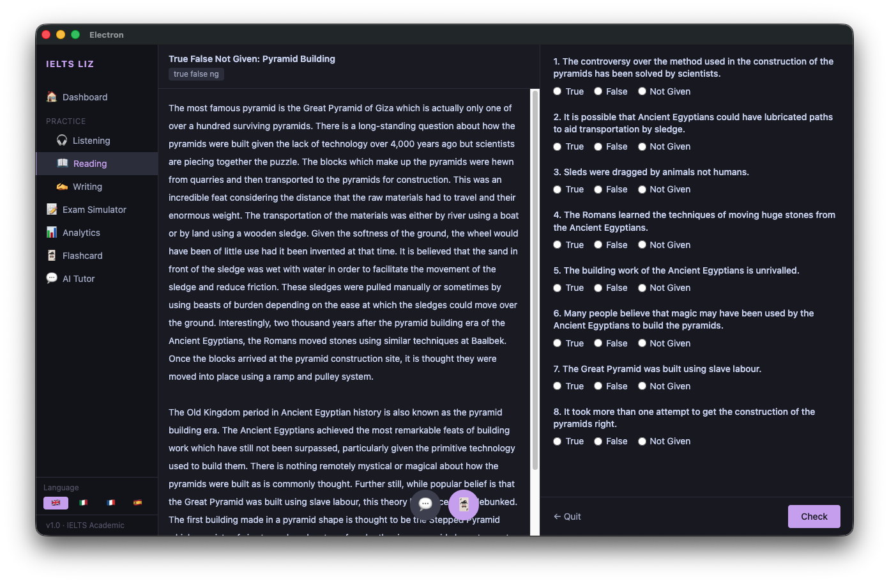 |

**Content:** 32 exercises covering all seven IELTS Reading question types: True/False/Not Given, Yes/No/Not Given, matching headings, matching paragraph information, multiple choice, sentence completion, summary completion, and short answer.

**The interface** uses a permanent **split-pane layout**: the passage fills the left 55% of the screen; questions and answers occupy the right 45%. Both halves scroll independently, so you can read and answer without losing your place.

Matching-headings questions label each paragraph (A, B, C…) automatically to match the question wording.

**"Find in passage"** is the most useful feature here. After submitting, any question you got wrong shows a small "Find in passage" link. Clicking it reveals a highlighted excerpt from the reading text — a ~300-character window centred on the correct answer, with the answer itself marked in yellow. This replaces the tedious manual search through a long passage.

Same practice modes as Listening (single, series by type, random), same band estimate logic, same persistence.

---

### Writing Practice

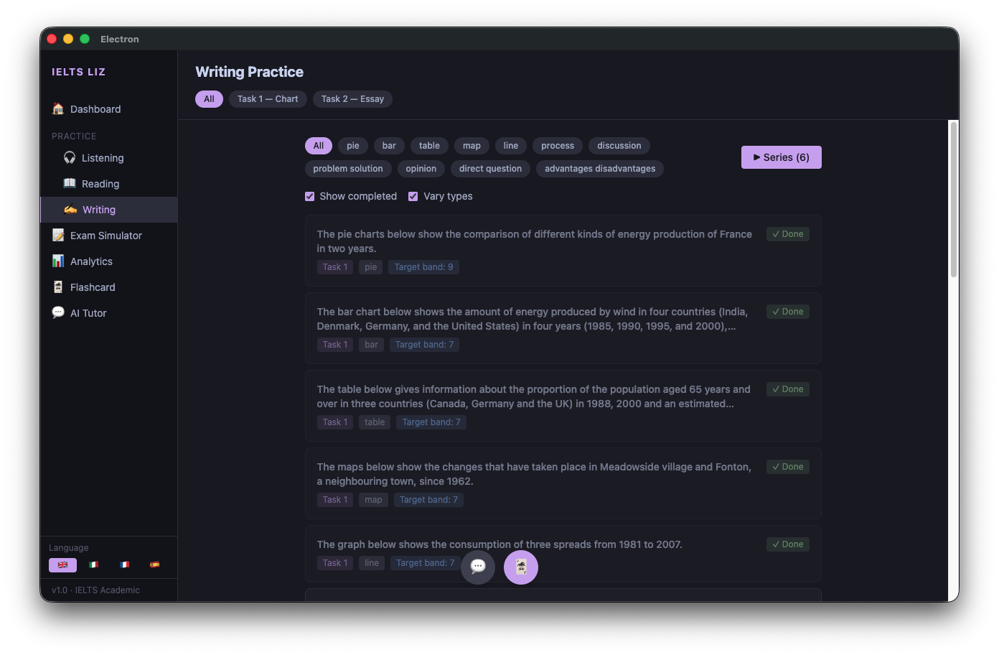

| Task 1 editor | Map task layout |
|---|---|
| 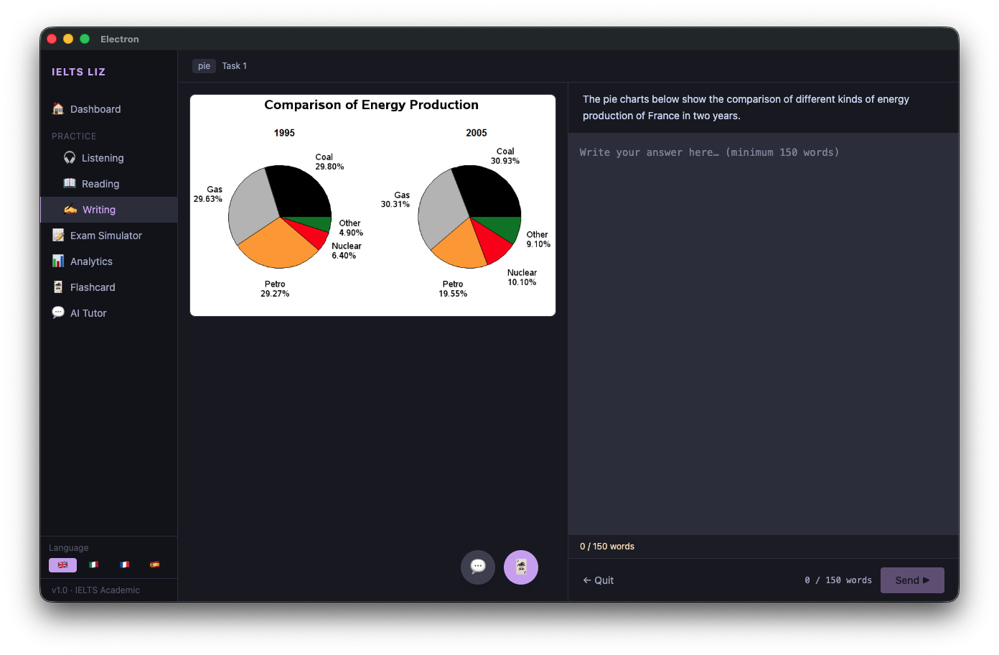 | 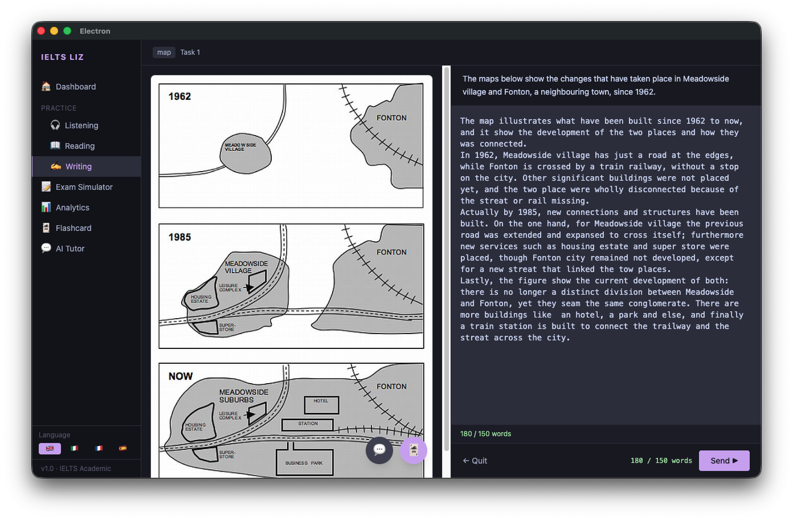 |

**Content:** 7 Task 1 exercises (bar, line, pie, table, map, and process diagram) and 13 Task 2 essays (opinion, discussion, problem/solution, direct question, advantages/disadvantages). Each task has a target band, a model answer, and key vocabulary/phrases.

**The workflow:**

1. Switch between **Task 1 — Grafico** and **Task 2 — Essay** tabs. Each task shows its type badge and target band score.
2. Select a task. The prompt (and chart image, for Task 1) appears in a fixed area above the editor so you can refer to it while writing.
3. Write in the full-height text editor. A **live word counter** at the bottom tracks your count against the IELTS minimum (150 words for Task 1, 250 for Task 2). The counter turns yellow when you're under the threshold and green when you meet it. The submit button stays disabled until you've written something.
4. Click **Invia**. The text is sent to the configured AI model (acting as an IELTS examiner). While it evaluates, the button shows a loading state.

**AI feedback includes:**
- An estimated **IELTS band score** (e.g. 6.5), displayed large
- A 2–3 sentence **overall summary** of the response
- A **strengths panel** (green) — what you did well
- An **improvements panel** (red) — specific things to fix
- **Vocabulary suggestions** — words and phrases that would raise the score, shown as chips

Below the feedback, a collapsible **Model answer** section shows the reference essay at the task's target band, plus key vocabulary or phrases worth studying.

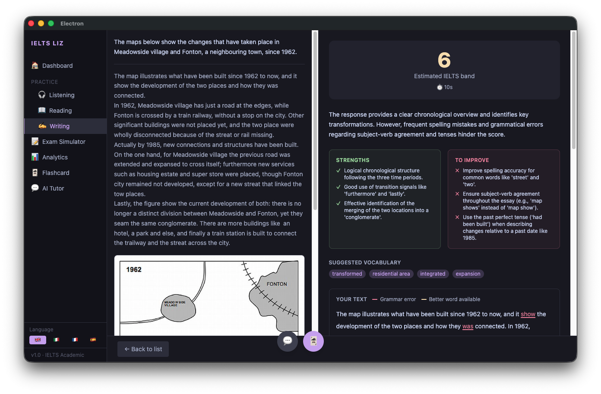

If the AI call fails (network issue, quota), a warning is shown and your text is still saved locally.

---

### Exam Simulator

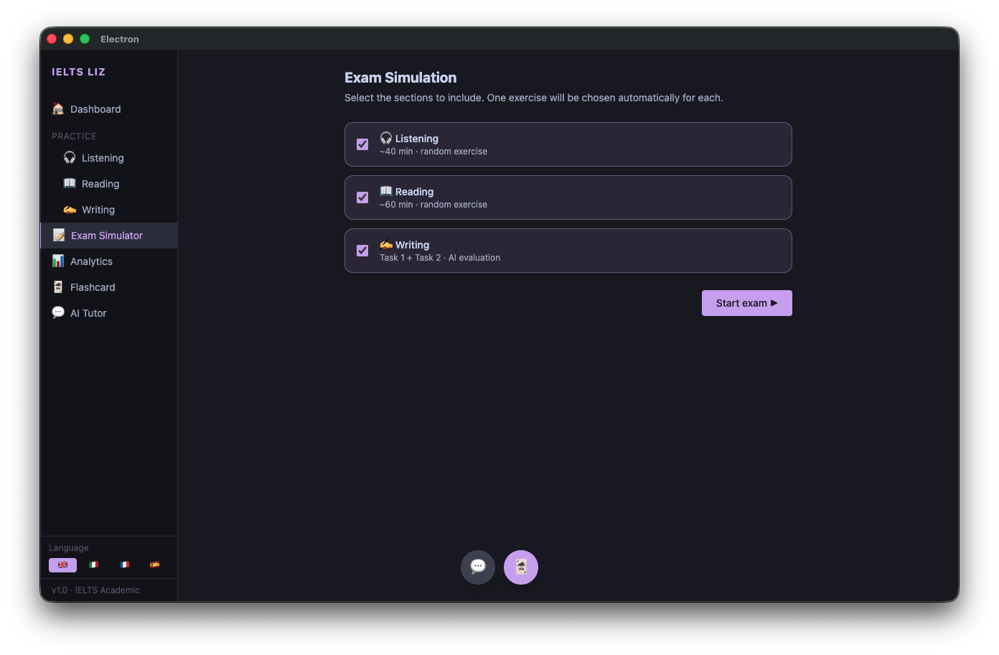

The full simulation mode. It chains Listening, Reading, and Writing in sequence, mimicking exam conditions with timers.

**Setup:** Choose which sections to include. You can run all three, or any subset (e.g. just Listening + Reading to skip the AI evaluation wait). Exercises are picked at random from the library for each section.

**During the exam:**

- A header bar shows the current section and position in the sequence (e.g. "Section 2 of 3 · Reading").
- **Listening** — a 40-minute countdown runs from the moment the exercise loads. At exactly 40:00, the app takes a **silent answer snapshot** (a yellow flash and a 📸 badge confirm it). You can keep editing answers after the snapshot. Exercises with a diagram or image show a **two-column layout** (image left, audio player + questions right); clicking the image opens a full-screen **lightbox**. Inline option labels (`A=Label`) in question text are stripped automatically.
- **Reading** — same 60-minute timer and snapshot mechanic. Inline option labels are stripped from question text as in practice mode.
- **Writing** — Task 1 and Task 2 are presented back to back, each with its own editor and word counter. A snapshot of each essay is taken at the standard IELTS time limits (20 min for Task 1, 40 min for Task 2). When Task 1 has a chart image, the layout splits into two columns: the prompt and image (clickable for lightbox) on the left, the writing editor on the right.

**After the last section**, the app evaluates both writing tasks in parallel via the configured AI model. A spinner shows "AI evaluation in progress" with a "skip evaluation" escape hatch if you don't want to wait.

**Results page:**

A summary table lists every section with three columns: score within the time limit, final score, and time spent. Writing rows show the AI band score. Below the table, expandable **AI feedback panels** show per-task analysis (the same strengths/improvements format as Writing Practice).

The entire run is saved as an exam record. Individual Listening and Reading sessions are saved with their question type, and Writing submissions are saved with their AI band score — all feeding into the Analytics dashboard.

---

### Flashcards

| Review session | Card library |
|---|---|
| 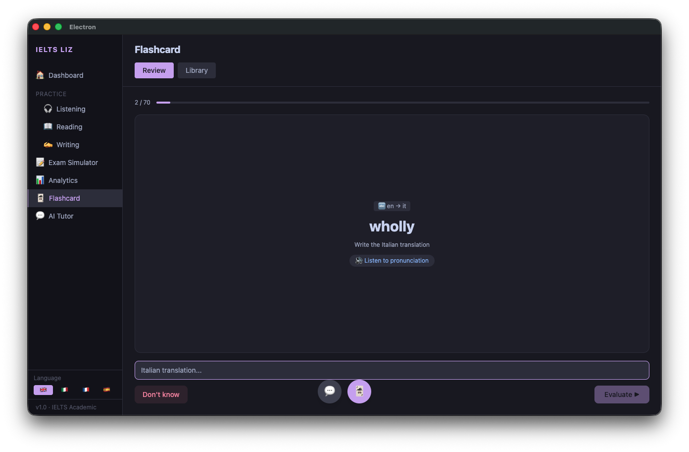 | 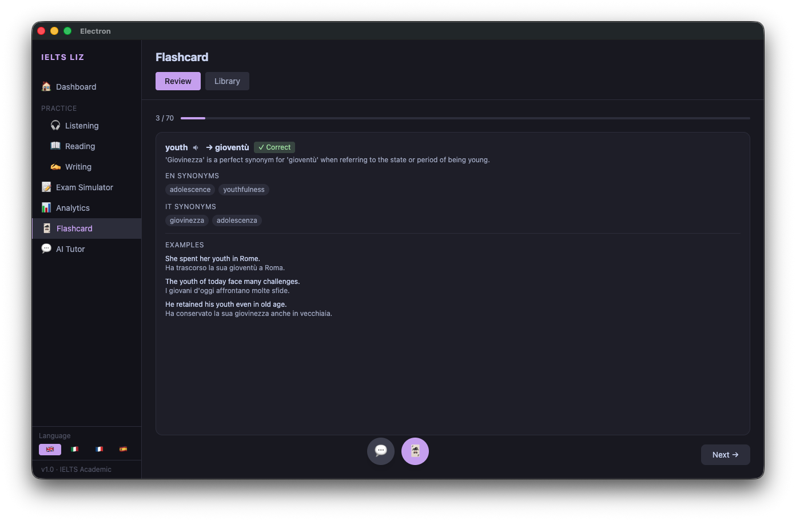 |

A vocabulary trainer with an **SM-2-inspired spaced-repetition scheduler**. Each card has a scheduled review date that moves further into the future after successful reviews, so words you know well stop appearing daily while words you struggle with stay frequent.

On first use, choose your **native language** (Italian, French, Spanish, German, or Portuguese). The choice is saved and used across card generation, review, AI evaluation, examples, and synonyms. You can switch languages later; each language has its own deck, and existing cards remain associated with the language in which they were created. Cards created before this feature are migrated to Italian automatically.

#### Adding a card

A **floating 🃏 button** in the bottom-right corner is always visible, on every page. Click it to open the Add modal without navigating away.

You can also **select any text** anywhere in the app (up to 4 words). A small popover appears near the selection with:
- An editable text field pre-filled with your selection
- A 🔊 **pronunciation button** — speaks the text aloud in British English
- A **+ Flashcard** button — opens the Add modal with the word pre-filled

Type any English word and press **Generate**. The AI produces a complete card in a few seconds:

- The word in English and its primary translation in the selected native language
- English synonyms and native-language synonyms (3 each)
- Three example sentences in English with translations in the selected language

Every field is editable before saving — useful if the AI picks an obscure meaning or if you want to add a personal note.

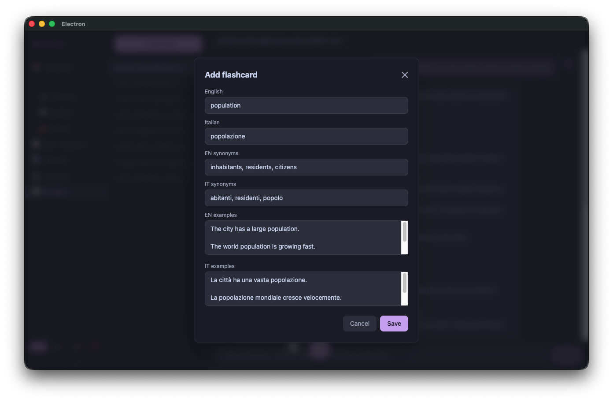

#### Review session

Only cards **due today** are included. If you've reviewed everything recently, the session shows "No cards to review today" and you're done.

For each card, the mode is randomly selected:

- **English → native language** (33% chance) — the English word is shown; type its translation.
- **Native language → English** (33% chance) — the translation is shown; type the English word.
- **Audio** (33% chance) — the word is spoken aloud via text-to-speech (British English accent, slightly slowed). You hear it, then type both the English spelling and the translation. Click the audio area to replay the word at any time.

Pressing **Enter** submits in all modes (including the two audio input fields). The answer is evaluated by the configured AI, which accepts spelling variants and synonyms — you don't have to match the exact translation stored on the card.

**After evaluation**, the result screen shows:
- Correct/incorrect status and a brief explanation from the AI
- English and native-language synonyms as small chips
- All three bilingual example sentences

Then you continue to the next card. A **progress bar** across the top tracks how far through the day's queue you are.

The scheduler updates each card silently in the background: a quality score of 1–5 (derived from the AI evaluation) adjusts both the interval until next review and the ease factor that controls how quickly the interval grows. The implementation is a simplified SM-2 variant with initial successful intervals of 1 and 3 days.

#### Card library

A scrollable list of every card in the currently selected language deck. Each entry shows the English word, its translation, and either a yellow "today" badge (due for review) or an "interval: N days" badge. Cards can be deleted with a two-step confirmation (click the bin icon, then "Elimina").

---

### AI Tutor Chat

The built-in tutor keeps separate conversations with persistent history, so you can ask for explanations, corrections, examples, or targeted practice without leaving the app.

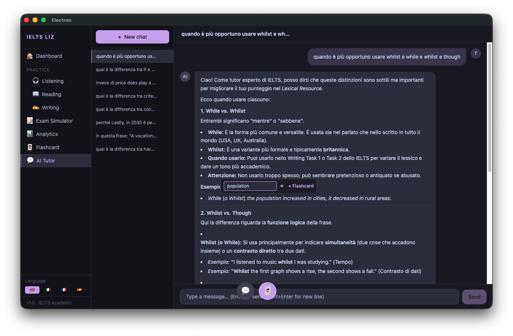

---

### Analytics

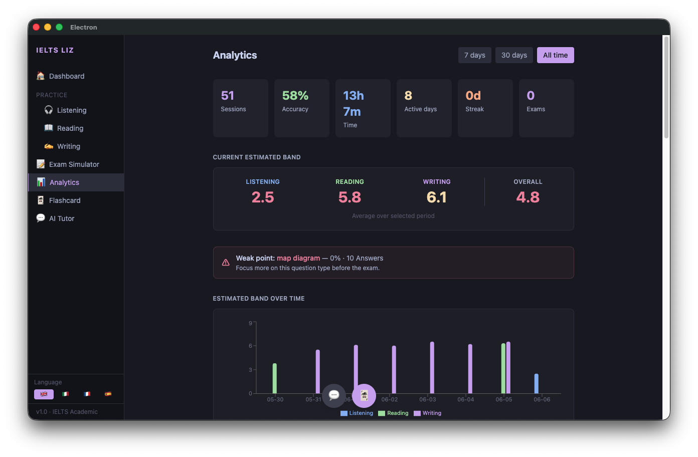

Deep progress tracking with a selectable time window (7 days, 30 days, or all time).

**Stat cards (6):** sessions completed, average accuracy, total study time, exam simulations run, days active, and current daily streak.

**Estimated band — current:** a prominent card showing a progress estimate for Listening, Reading, Writing, and Overall. Listening and Reading values are derived from average session accuracy scaled to 9; Writing uses stored AI band scores. These dashboard estimates are directional analytics and are distinct from the section-specific conversion table used after an individual exercise. A highlight card below calls out your weakest area.

**Band trend over time:** a line chart showing how Listening and Reading estimates evolve across recorded activity dates. Useful for spotting a plateau or confirming that practice is paying off.

**Accuracy trend:** a second line chart showing raw accuracy (%) per week for Listening and Reading, making it easy to separate "I'm getting better" from "I'm just doing easier exercises".

**Activity chart:** a grouped bar chart showing session counts by stored date and section (Listening, Reading, Writing).

**Per-section cards:** one card each for Listening, Reading, and Writing, showing accuracy, number of sessions, and total time invested.

**Accuracy by question type:** a table of every question type that has recorded answers, with accuracy percentage (colour-coded: green ≥ 80%, yellow ≥ 60%, red < 60%), total attempts, average time per question, and a speed trend column showing whether you're answering faster or slower in recent sessions vs. older ones. This is the most actionable view — if `matching_headings` sits at 52% and is getting slower, that's your next drill target.

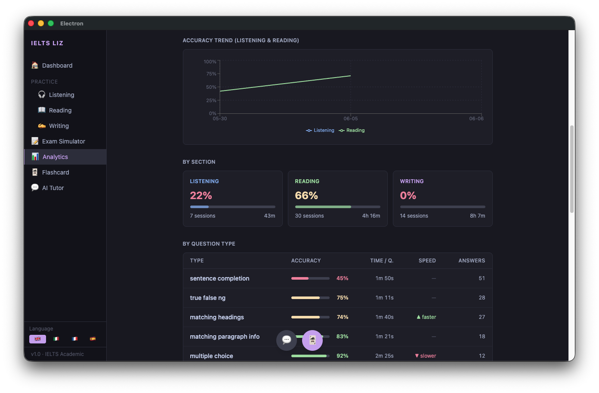

**Writing bands:** average AI band score for Task 1 and Task 2 separately, with attempt counts.

**Exercise coverage:** progress bars showing how many exercises you've completed at least once out of the total available, per section. Useful for ensuring you're not repeatedly doing the same exercises.

**Flashcard stats:** total cards in your deck, mastered cards (interval ≥ 21 days), cards due today, and overall retention rate (percentage of reviews answered correctly).

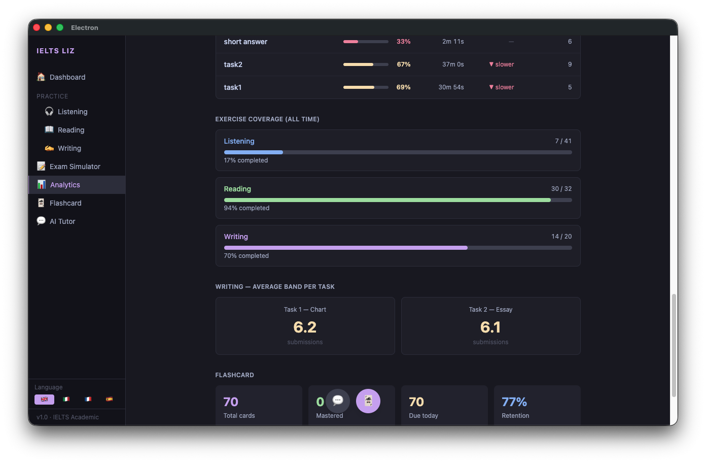

All charts use dark-theme styling consistent with the Catppuccin Mocha colour palette.

---

## Application Structure

IELTS Study follows Electron's three-layer model. The renderer never opens the database, reads arbitrary files, or calls an AI provider directly.

```text
React renderer
      │ typed window.api calls
      ▼
Preload bridge (contextBridge + ipcRenderer.invoke)
      │ Electron IPC
      ▼
Main process
      ├── SQLite database in Electron userData
      ├── bundled data/*.json exercise library
      └── configured external AI provider

Renderer ── HTTPS ──► selected images/audio on ieltsliz.com
```

```
src/
├── main/
│   ├── index.ts         # Electron main process, window creation
│   ├── db.ts            # SQLite schema and migrations (better-sqlite3)
│   ├── ipc.ts           # All IPC handlers (exercises, sessions, AI calls)
│   └── keyStore.ts      # AES-256 key decryption at runtime
├── preload/
│   └── index.ts         # Exposes window.api to the renderer
└── renderer/src/
    ├── App.tsx           # Router, sidebar, floating flashcard/chat buttons, text-selection popover
    ├── i18n/             # Internationalisation setup
    │   ├── index.ts      # i18next init, LANGUAGES list, setLanguage() helper
    │   └── locales/      # it.ts, en.ts, fr.ts, es.ts — all UI strings
    ├── pages/            # One file per route
    │   ├── Dashboard.tsx
    │   ├── Analytics.tsx
    │   ├── Chat.tsx
    │   ├── ExamSimulator.tsx
    │   ├── Flashcard.tsx
    │   └── practice/     # Listening, Reading, Writing
    ├── components/
    │   ├── exam/         # ExamListeningSection, ExamReadingSection, ExamWritingSection
    │   ├── flashcard/    # ReviewSession, CardLibrary, AddCardModal, language picker
    │   └── practice/     # AudioPlayer, QuestionInput, ReadingPassage, ResultsPanel, WritingEditor, WritingFeedback, utils
    └── types/index.ts    # All shared TypeScript interfaces and the IElectronAPI contract
```

<details>
<summary><strong>Runtime responsibilities and lifecycle</strong></summary>

### Main process

`src/main/index.ts` loads development environment variables or the packaged encrypted payload, waits for Electron readiness, registers IPC handlers, and creates the application window. New-window requests are denied inside the app and opened in the operating-system browser.

`src/main/ipc.ts` is the application service layer. It loads exercise JSON, stores sessions and settings, derives analytics, updates flashcard scheduling, manages chats, and orchestrates provider calls.

### Preload bridge

`src/preload/index.ts` exposes an explicit asynchronous API through `contextBridge`. The shared `IElectronAPI` contract lives in `src/renderer/src/types/index.ts`. Any IPC change must update the shared type, preload method, and main-process handler together.

### Renderer

React owns routing, transient session state, scoring helpers, timers, charts, and user interaction. Components must treat every preload call as a failure boundary and provide appropriate loading, disabled, error, and retry states.

### Main flows

```text
Practice
  exercise JSON → renderer queue → local scoring → session + answers → results

Writing
  task + essay → AI evaluation → feedback → writing row in sessions

Exam
  selected sections → timed snapshots → final results → sessions + exam_runs

Flashcard
  native language → AI-generated card → review → AI evaluation → scheduler update

Chat
  local conversation history → provider request → local assistant message
```

### Build boundaries

`electron-vite` creates separate main, preload, and renderer outputs. Provider SDKs and Zod are bundled into the main output; `better-sqlite3` remains a native external dependency and is unpacked from ASAR. Exercise JSON and the packaged environment payload are copied as extra resources.

See [Architecture](docs/ARCHITECTURE.md) for lifecycle details, extension rules, and current trust-boundary limitations.

</details>

---

## Local Database

SQLite file stored in the OS user data directory (resolved via Electron's `app.getPath('userData')`). All writes use WAL mode for reliability.

| OS | Path |
|----|------|
| macOS | `~/Library/Application Support/IELTS Study/` |
| Windows | `%APPDATA%\IELTS Study\` |
| Linux | `~/.config/IELTS Study/` |

| Table | What it records |
|-------|----------------|
| `sessions` | Every completed Listening, Reading, or Writing attempt. Writing text, word count, band, notes, and AI feedback are stored in this table too |
| `answers` | Each question's user answer, correct answer, and correctness flag, linked to its session |
| `exam_runs` | Per-simulation record with timestamps and Listening/Reading/Writing scores |
| `flashcards` | Per-language vocabulary cards, translations, synonyms, examples, and SM-2 scheduling fields |
| `flashcard_reviews` | Every individual review with direction, user answer, quality score, and correctness |
| `chats` | Named AI tutor conversations with creation and last-update timestamps |
| `chat_messages` | Each message in a chat, with role (user/assistant), content, and timestamp |
| `settings` | Key/value preferences, including interface language and selected flashcard language |

Schema creation and migrations run at startup. The current flashcard migration inspects `PRAGMA table_info`, adds missing generic language columns, and copies legacy Italian values into the new fields. Full details and backup guidance are in [Data Model](docs/DATA_MODEL.md).

<details>
<summary><strong>Relationships, migrations, analytics, backup, and retention</strong></summary>

### Relationships

```text
sessions   1 ─── * answers
flashcards 1 ─── * flashcard_reviews
chats      1 ─── * chat_messages

exam_runs and settings are independent records.
```

Foreign-key declarations exist, but `PRAGMA foreign_keys = ON` is not currently enabled explicitly. Full reset therefore deletes dependent tables in a controlled order rather than relying on cascade behavior.

### Migration policy

`migrateDb()` must remain safe to execute on every startup. The current implementation creates missing tables, inspects existing flashcard columns, adds generic native-language fields, and migrates legacy Italian data. There is no schema-version ledger yet; larger future migrations should add one and execute multi-step upgrades transactionally.

### Analytics rules

- time-window filters use the session start timestamp;
- streaks use all completed sessions;
- Listening and Reading accuracy comes from stored per-question answers;
- Writing bands use stored AI evaluations;
- exercise coverage is all-time;
- speed trends require at least four sessions of the same question type;
- flashcard metrics apply only to the currently selected language deck.

The Analytics dashboard's progress bands are averages derived from session accuracy and are not the same calculation as the section-specific band shown after an individual exercise.

### Backup and reset

There is no built-in export/import flow. For a manual backup, close the application and copy `ielts.db` from the user-data directory. The file can contain essays, answers, flashcards, and chat history and should be handled as private data.

Full reset removes study, exam, flashcard, review, and chat records but retains settings such as interface and flashcard language. No automatic retention policy is applied.

See [Data Model and Persistence](docs/DATA_MODEL.md) for the column-level schema and restore guidance.

</details>

---

## Internationalisation

The entire UI is translated into four languages: **Italian (it), English (en), French (fr), Spanish (es)**.

A language switcher in the sidebar lets you change language at any time. The selection is written to the `settings` table in SQLite and restored automatically on the next launch. English is the default on a fresh install.

All translations live in `src/renderer/src/i18n/locales/`. Each file is a TypeScript `export default` object rather than JSON. i18next pluralisation (`_one` / `_other`) and interpolation (`{{variable}}`) are used where needed. The current setup does not enforce cross-locale key parity at compile time, so new keys must be added to all four files and checked during review.

Interface language and flashcard native language are independent settings. The interface supports English, Italian, French, and Spanish; flashcard decks support Italian, French, Spanish, German, and Portuguese while the learned language remains English.

---

## AI Integration, Privacy, and Security

All AI calls run from the Electron **main process** over IPC, so the renderer does not receive the API key. The provider and model are configurable via `.env` — no code changes are required to switch.

> **Privacy boundary:** persistence is local, but AI input is sent to the selected provider and exercise media can be requested from IELTS Liz. Essays, flashcard answers, translations, and supplied chat messages can therefore leave the device when the corresponding feature is used. Provider retention and processing follow the provider account and its terms.

**Supported providers:** `anthropic`, `google`, `openai` (powered by the [Vercel AI SDK](https://sdk.vercel.ai))

```bash
# Example configurations
AI_PROVIDER=anthropic  AI_MODEL=claude-haiku-4-5-20251001  # fast, cheap
AI_PROVIDER=google     AI_MODEL=gemini-2.0-flash
AI_PROVIDER=openai     AI_MODEL=gpt-4o-mini
```

| Call | When it fires | What the model does |
|------|--------------|---------------------|
| `generateFlashcard` | User clicks "Generate" in the Add modal | Returns translation, synonyms, and example sentences as JSON |
| `evaluateAnswer` | Flashcard text-mode review submission | Judges translation correctness, assigns a quality score (1–5), suggests alternatives |
| `evaluateAudioAnswer` | Flashcard audio-mode review submission | Separately judges English spelling and the native-language translation |
| `evaluateWriting` | Writing practice or exam submission | Acts as an IELTS examiner, returns band, summary, strengths, improvements, vocab |
| `chatMessage` | User requests an AI tutor reply | Sends the supplied conversation messages with the IELTS tutor system instruction |

AI responses are parsed with a character-level JSON fixer that handles literal newlines and other formatting quirks common in streamed model output — all four handlers share the same `parseAiJson<T>()` utility.

Development reads the key from the ignored local `.env`. The macOS packaging script creates `resources/env.enc` using AES-256-CBC, but the decryption secret is embedded in the application; this prevents casual plaintext inspection, not extraction by a determined recipient. Do not distribute a shared production credential this way. Prefer a user-supplied key stored in the OS credential vault or a controlled backend. See [Security](SECURITY.md).

<details>
<summary><strong>Data flow, response handling, failure modes, and security limitations</strong></summary>

### What stays local and what leaves the device

| Data | Local | Remote use |
|---|---:|---|
| Listening/Reading answers and scores | Yes | Not sent unless manually copied into chat |
| Writing essay and feedback | Yes | Prompt, essay, task type, and word count go to the AI provider |
| Flashcards and review history | Yes | Words, translations, references, and submitted answers go to the provider when generated/evaluated |
| Chat history | Yes | The conversation messages supplied for a reply go to the provider |
| Exercise JSON | Bundled | No runtime request |
| Listening audio and Writing images | URL only | Loaded directly from `ieltsliz.com` |
| Product telemetry | Not implemented | None initiated by the app |

Without a network connection, bundled Reading content and saved progress remain accessible, but provider features and remotely hosted media can be unavailable.

### Structured response handling

Flashcard and Writing prompts request JSON. `parseAiJson()` removes Markdown fences, extracts an object-shaped block, repairs literal control characters inside JSON strings, and parses it. Responses are not currently schema-validated. Adding strict Zod validation and bounds before rendering or persistence is a priority hardening task.

### Failure behavior

- Writing text is retained when evaluation fails.
- Exam writing evaluation can be skipped.
- Flashcard generation exposes retryable errors.
- Flashcard review provides a degraded AI-unavailable result path.
- Chat history remains stored when reply generation fails.

There is no application-level timeout, cancellation, retry, failover, cost limit, or rate limiter for provider calls. Configure provider-side budgets for development and distribution.

### Current Electron and IPC risks

- `sandbox` is disabled and `webviewTag` is enabled even though the current app does not need a webview.
- IPC is typed at compile time but most payloads lack runtime schema validation.
- SQLite foreign-key enforcement is not explicitly enabled.
- The packaged shared-key design is reversible by someone who can inspect the application.
- macOS artifacts are currently ARM64-only and not notarized.

Before public distribution, remove unused webview support, enable sandboxing where compatible, set isolation options explicitly, validate every IPC request and AI response, enable tested database integrity rules, and move credentials to an OS vault or backend.

See [AI, Privacy, and Network Use](docs/AI_AND_PRIVACY.md) and [Security Policy](SECURITY.md) for the complete model and hardening checklist.

</details>

---

## Content Summary

| Section | Exercises | Question types / formats |
|---------|-----------|--------------------------|
| Listening | 41 | gap fill, form completion, multiple choice, map/diagram, table |
| Reading | 32 | 8 types: T/F/NG, Y/N/NG, matching headings, matching paragraph info, multiple choice, sentence completion, summary completion, short answer |
| Writing Task 1 | 7 | bar, line, pie, table, map, process |
| Writing Task 2 | 13 | opinion, discussion, problem/solution, direct question, advantages/disadvantages |

---

## Content Pipeline

The runtime datasets under `data/` are maintained separately from application code. `npm run scrape` runs the IELTS Liz collectors sequentially and **overwrites all four JSON files**, so it must be treated as a reviewed maintenance operation rather than a routine build step.

<details>
<summary><strong>Scraping, validation, provenance, and responsible maintenance</strong></summary>

### Collection process

- Listening and Reading iterate curated URL lists, use a 15-second request timeout, and wait 1.5 seconds after each request.
- The collectors infer question types and extract page text, questions, answers, audio, and passages with heuristic selectors.
- Writing discovers links from hub pages, infers chart/essay type, and extracts prompts, images, and model answers where available.
- Failed pages are skipped, and successful results replace the existing datasets at the end of the run.

Because extraction is heuristic, generated JSON is not publication-ready automatically. Before accepting a refresh, verify URLs, stable IDs, exercise counts, passages, question/answer alignment, options, T/F/NG versus Y/N/NG classification, remote media, and ownership/permission.

Recommended automated additions include JSON Schema or Zod validation, duplicate detection, empty-field checks, enum validation, contiguous question indexes, rate-limited link checking, and explicit count snapshots.

### Safe workflow

```text
isolated branch
  → preserve current datasets
  → run scraper once
  → inspect complete data diff
  → manually correct extraction
  → confirm provenance and permissions
  → run tests, app smoke test, and production build
```

Do not combine a broad dataset refresh with unrelated code changes. Respect site terms, robots directives, access controls, rate limits, and removal requests.

### Rights

The software license does not apply to IELTS Liz material. Attribution does not provide redistribution permission. Public or commercial distribution requires the appropriate rights; otherwise remove the datasets, remote media references, and screenshots containing protected material.

See [Exercise Content Pipeline](docs/CONTENT_PIPELINE.md) and [Third-Party Content Notice](THIRD_PARTY_CONTENT.md).

</details>

---

## Testing and Quality

```bash
npm run typecheck       # main/preload + renderer TypeScript
npx vitest run          # complete test suite
npm run lint            # ESLint + Prettier rules
npm run build           # typecheck + production bundles
```

The current verified baseline is **56/56 tests passing across 5 test files**, with TypeScript checks and the production build passing. The repository-wide lint command is not yet green because of accumulated legacy formatting and rule violations; new changes should not add further errors.

<details>
<summary><strong>Test scope, native modules, smoke testing, and contribution process</strong></summary>

### Automated coverage

- database creation, migration idempotence, and legacy flashcard migration;
- flashcard review-mode selection and quality mapping;
- analytics formatting;
- answer normalization, scoring, filters, queues, excerpts, and Listening/Reading band conversion;
- Writing helper behavior.

The band tests explicitly cover perfect scores, half bands, empty exercises, and different Listening/Academic Reading thresholds.

### Native module caveat

`better-sqlite3` must match the active runtime ABI. Electron packaging rebuilds it for Electron, while Vitest uses the host Node.js ABI. If tests report `NODE_MODULE_VERSION` incompatibility, run `npm rebuild better-sqlite3`, then verify the packaged application again because packaging may rebuild it for Electron.

### Manual smoke test

Release review should cover a fresh database, legacy database upgrade, both language settings, all flashcard modes, practice queues, Writing success/failure, every exam section combination, snapshots, chat lifecycle, empty/populated analytics, reset, offline behavior, and packaged remote media.

### Engineering rules

Keep database/provider access in the main process, expose minimal preload APIs, validate new IPC payloads at runtime, make migrations idempotent, update all four locale files, separate content refreshes from code, and update documentation whenever behavior changes.

See [Testing and Releases](docs/TESTING_AND_RELEASES.md), [Contributing](CONTRIBUTING.md), and [Troubleshooting](docs/TROUBLESHOOTING.md).

</details>

---

## Building and Releasing

```bash
# macOS (produces a .dmg in dist/)
npm run build:mac

# Windows
npm run build:win

# Linux
npm run build:linux
```

`npm run build:mac` encrypts `.env` before calling `electron-builder`, so the packaged resources contain `env.enc` rather than the raw file. This is packaging obfuscation only because the application contains the matching decryption secret; it must not be used to distribute a valuable shared credential.

The checked-in builder configuration currently produces an **Apple Silicon (`arm64`) DMG** and has notarization disabled. Windows and Linux scripts exist but are not documented as verified release pipelines. Packages produced without signing/notarization are development artifacts and may trigger operating-system warnings. Follow the complete [release checklist](docs/TESTING_AND_RELEASES.md) before distribution.

<details>
<summary><strong>Release checklist and current packaging limitations</strong></summary>

### Before packaging

- review the working tree and exclude `.env`, databases, logs, caches, and provider output;
- run typecheck, focused tests, the full suite, lint, and the production build;
- validate exercise counts, JSON structure, source attribution, and remote media;
- confirm the provider credential is scoped, budget-limited, and suitable for the distribution model;
- inspect documentation for behavior, privacy, migration, and platform changes.

### Package verification

- ensure `better-sqlite3` matches the target Electron ABI and architecture;
- replace scaffold package metadata such as author, description, homepage, and the generic renderer title;
- configure product version, icons, app ID, signing identity, and artifact naming;
- enable macOS notarization before public macOS distribution;
- test install, first launch, database upgrade, AI failure, offline use, and uninstall on every claimed platform;
- inspect the final artifact for credentials, databases, logs, and unexpected source maps.

### Current limitations

- macOS target: DMG, ARM64 only;
- notarization: disabled;
- universal/x64 macOS pipeline: not configured;
- Windows/Linux installer and signing: not verified;
- package metadata: still contains scaffold values;
- `engines` and `packageManager`: not pinned;
- formal versioning, changelog, and supported-version policy: not defined.

Adopt a versioning policy, maintain release notes, tag the tested commit, publish checksums, and document database compatibility before calling an artifact a supported release.

</details>

---

## Tech Stack

| Layer | Technology | Version |
|-------|-----------|---------|
| Desktop shell | Electron | 39 |
| Frontend framework | React + TypeScript | 19 / 5.9 |
| Styling | Tailwind CSS v4 (Catppuccin Mocha theme) | 4.3 |
| Routing | React Router | 7 |
| Charts | Recharts | 3 |
| Database | better-sqlite3 | 12 |
| Internationalisation | i18next + react-i18next | 25 / 15 |
| AI | Vercel AI SDK (Anthropic / Google / OpenAI) | 6 |
| Build tooling | electron-vite + electron-builder | 5 / 26 |
| Testing | Vitest | 4 |
